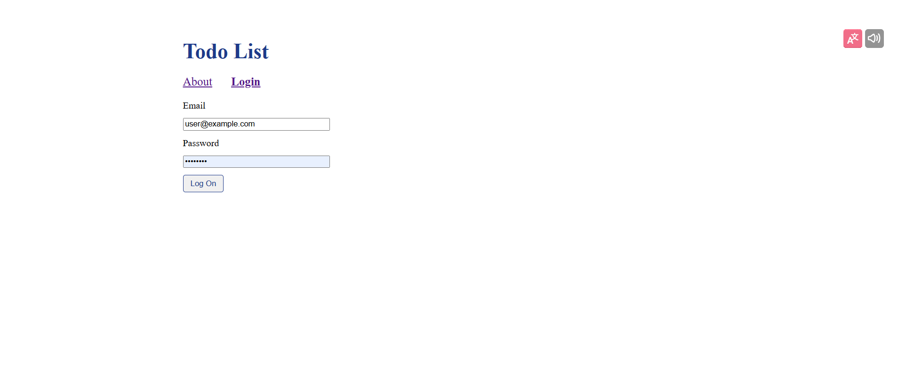
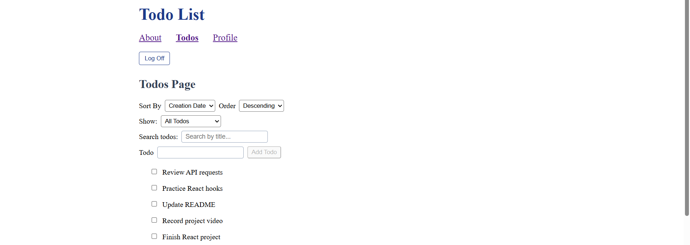
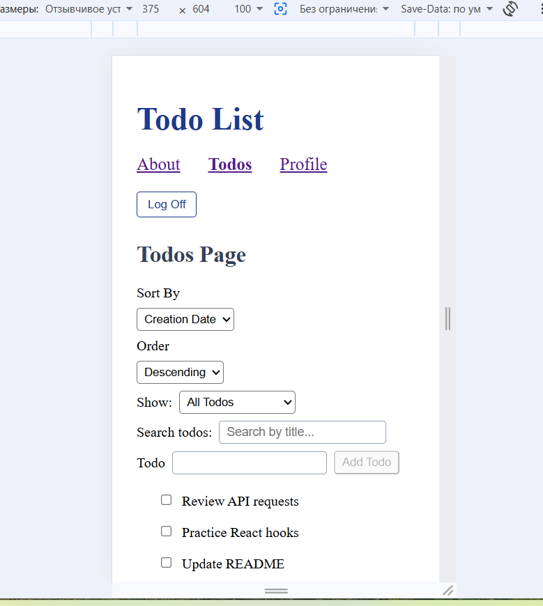

# Todo List

## Description

This is a Todo List application built with React and Vite.

Users can add tasks, edit them, mark them as completed, search, sort, and filter todos.

Users must log in before they can view and manage their todos.

## 🚀 Live Demo

[View Live Application](https://todo-list-beta-navy.vercel.app)

## Security Features

- Input validation
- DOMPurify sanitization for creating and updating todos
- Protected routes for authenticated users

## Technologies Used

- React
- React Router
- Vite
- JavaScript
- CSS Modules

## Features

- Login page
- User login required to view todos
- Add todos
- Edit todos
- Mark todos as completed
- Search todos
- Sort todos
- Filter todos
- Responsive design

## Installation

```
git clone https://github.com/IBCDlab/Todo-list.git
cd Todo-list
npm install
```

## Environment Setup

No environment variables are required for local development.

## Run

```
npm run dev
```

Then open the local URL shown in the terminal.


## Available Scripts

### Development Server

```
npm run dev
```

Starts the development server.

### Production Build

```
npm run build
```

Builds the application for production.

### Preview Production Build

```
npm run preview
```

Runs a local preview of the production build.


## What I Learned

In this project I learned:

- React components
- React Router
- useState
- useReducer
- Context API
- CSS Modules
- Responsive design

I also learned how to organize files in a React project and work with API requests.

## Challenges

Some of the more challenging parts of this project were working with React hooks such as useState, useEffect, and useReducer.

The project also helped me better understand data flow in React, component communication, API requests, and client-side routing with React Router.

Working through these topics gave me a better understanding of how React applications are built and organized.

## Future Improvements

- Add dark mode
- Add more filtering options
- Improve loading and feedback messages

## Screenshots

### Login Page



### Desktop View



### Mobile View



## Design Decisions

I used CSS Modules to keep styles organized and avoid conflicts between components.

The application was designed to work on desktop, tablet, and mobile screens.

The goal was to create a clean and simple interface that is easy to use.

## Author

Created as part of the Code the Dream React course.

## License

This project is licensed under the MIT License.

## Contact

GitHub: https://github.com/IBCDlab